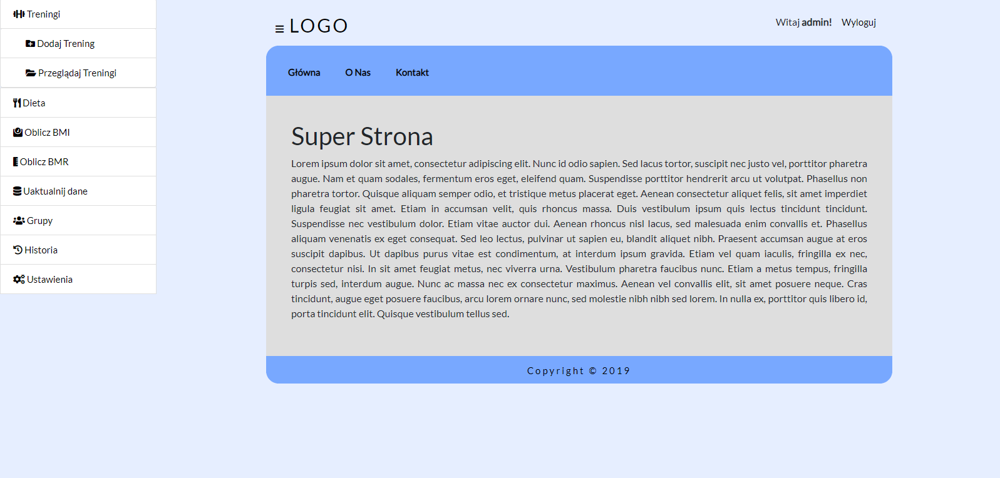

# myCookBook
<br/><br/>
This is a FitApp - web application which allows to monitor users' lifestyles. 
The FitApp allows users to plan - daily calories, meals, trenings etc.

## Technologies
* ASP.NET 4.6.1
* Entity Framework 6
* MVC 5+

## Environment
* Visual Studio 2017
* .NET Framework 4.6.1

## Features
* Login system
* Training management
* Meals management
* BMI and BMR calculator
* Body measurement management (with history)
* Creating and managing user groups
* A system of challenges for each group
* User data settings
* Access to the group API (JSON)
* The administrator has access to manage data (sample meals, trainings etc.) - These data can be added by all users to their own
personalized workouts, meals etc.

## Screenshot


## Setup
* Clone this repo to your desktop
```
git clone https://github.com/m-uszynski/fitapp.git
```
* Change the database storage path in `Web.config`
```
<connectionStrings>

    <add name="FitApp" connectionString="Data Source=(LocalDB)\MSSQLLocalDB;AttachDbFilename=C:\.....\Database.mdf;Integrated Security=True" providerName="System.Data.SqlClient" />
    
  </connectionStrings>
```
* Run `Update-Database` in Package Manager Console (to create database and seed data)
* Build and run solution to load website in browser
* Admin login: 'admin', Admin password: 'qwerty'

## Authors
Piotr Jasiński, Konrad Wilczek, Mateusz Uszyński
